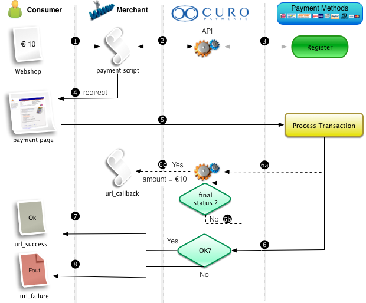

# Transaction Flow

The Transaction API Module enables processing of available payment methods for a merchant in the CURO system.
> Processing of live transactions is only possible when:
> * the Merchant account is pending or approved
> * the website is pending or approved
> * the payment module is enabled for the website

Transactions in the CURO system can have the following general status:
* `registered`
This is the state after a transaction was registered via the API. If there is no update within 15 minutes the transaction will automatically be expired
* `prepare`
Internal state indicating all required transaction information is set to perform the transaction for the payment method.
* `pending`
Status indicating the transaction is still pending
* `success`
Transaction was completed succesfully
* `failure`
The transaction failed
* `cancel`
The transaction was cancelled by the payment method or the consumer

Detailed transaction status information can be found in the [Transaction Status Codes](../Transaction/Transaction-Status-Codes.md).

Transaction Processing Flow

Below is a simplified schematic overview of the recommended processing flow of transactions using this API.

Step | Description
--- | ---
1 | Consumer selected a payment method and clicks `Pay` button in the webshop
2	| Webshop payment script calls the [CURO Payments Transaction API](../../reference/Transaction.v1.yaml) to register the transaction.
3	| If required CURO will prepare or register information with our partner for the chosen Payment Method.<nl/>Response is send back to the Webshop containing: action=redirect and the url value.<nl/>If not all required parameters are supplied, the url can also be a url to the CURO payment pages so the consumer can supply the missing parameters. These pages can be styled with the shop logo and colors.
4	| Webshop redirects the consumer to the received URL; consumer ends up on the selected Payment Method's page.
5	| Consumer authenticates the transaction which is processed by the Payment Method.
6	| After processing the Payment Method forwards the user back to CURO where the transaction status is determined. 
<nl/> | `Depending on the Payment Method and transaction status CURO will start a process to check the transaction status until a final status is reached.`
<nl/> | 6a Retrieve transaction status from Payment Method.
<nl/> | 6b Check if final status is reached or transaction has expired.
<nl/> | 6c Call url_callback with final status.
<nl/> | Although it is possible to retrieve the transaction status via this API, the recommended way is using the url_callback to automatically receive status updates! Please see Callback for an overview of arguments you will receive on the url_callback. The API will always call the url_callback (and wait for a response) before the consumer is redirected to the landing page so, if there are no issues somewhere in the chain, the payment status in the webshop will always be updated when the consumer returns.
7 |	Consumer is redirected back to the Webshop (url_success, url_failure or url_pending depending on the current transaction status).<nl/>Additional GET arguments will automatically be appended to this URL: status, code and reference.See [Return URL](6.ReturnURL.md) for details.
